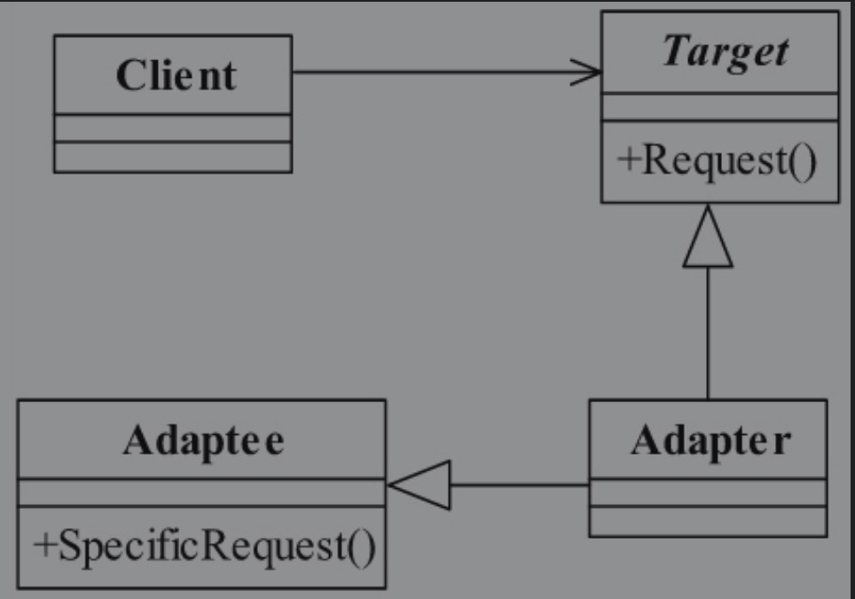

# 1. 基本概念
适配器模式，顾名思义，这个模式就是用来做适配的，它将不兼容的接口转换为可兼容的接口，让原本由于接口不兼容
而不能一起工作的类可以在一起工作。

## 1.1 生活中的例子
你的iphone x的手机，想要听歌，但是耳机忘记带了，所以和我来借，可是我是国产的OPPO，
所以你从包里拿出来一个转换插头，让耳机插到转换插头上，再插到手机上，这个转换插头就是适配器。

# 2. 应用场景
## 2.1 封装有缺陷的接口设计

## 2.2 统一多个类的接口设计

## 2.3 替换依赖的外部系统

## 2.4 兼容老版本接口

## 2.5 适配不同格式的数据

