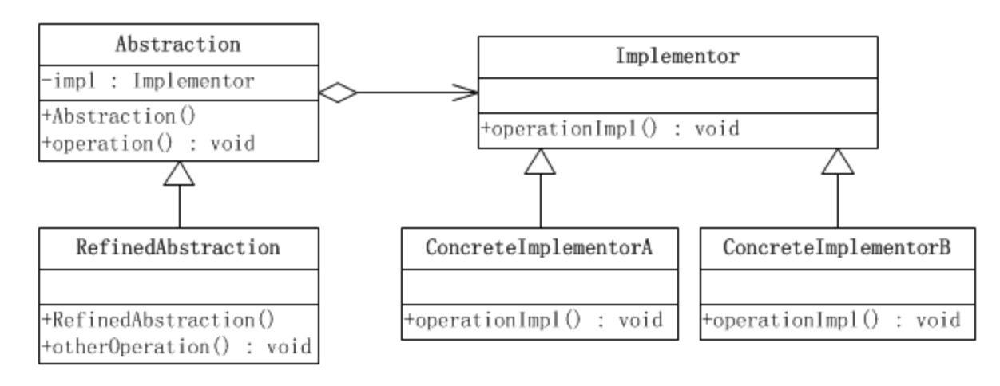
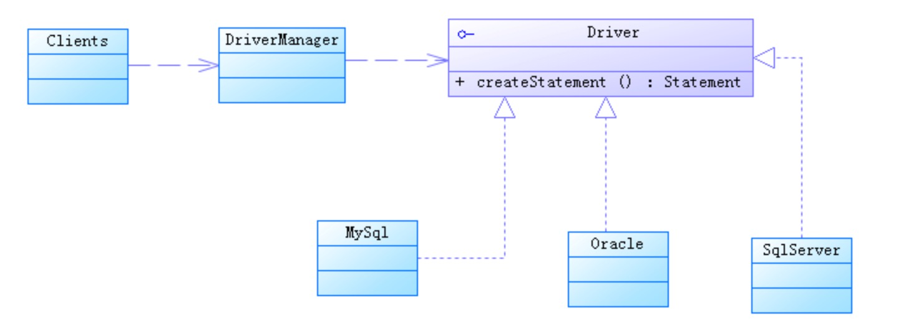

# 1. 基本概念
"将抽象化(Abstraction)与实现化(Implementation)解耦，使得两者可以独立地变化"。

这句话很短，但是第一次读到这句话的人很可能都会思考良久而不解其意。这句话有三个关键字：抽象化、实现化和解耦。

- 抽象化

从众多的事物中抽取共同的、本质的特征，而舍弃非本质的特征，就是抽象化。例如，苹果、香蕉、生梨、桃子等，它们的共同特征就是水果。
得出水果概念的过程，就是一个抽象化的过程。

- 实现化

抽象化给出的具体实现，就是实现化。

- 解耦

所谓耦合，就是两个实体的行为的某种强关联。而将它们的强关联去掉，就是耦合的解脱，或称解耦。在这里，解耦是指将抽象化和实现化之间
的耦合解脱开，或者说是将它们之间的强关联改换成弱关联。

在Java中，继承关系是强关联，而聚合关系是弱关联。

**另一种理解方式更加简单，类似“组合优于继承”设计原则，这种理解方式更加通用，应用场景比较多。**

# 2. 桥梁模式的结构


桥梁模式所涉及的角色有：
- 抽象化(Abstraction)角色：抽象化给出的定义，并保存一个对实现化对象的引用；
- 修正抽象化(RefinedAbstraction)角色：扩展抽象化角色，改变和修正父类对抽象化的定义。
- 实现化(Implementor)角色：这个角色给出实现化角色的接口，但不给出具体的实现。
- 具体实现化(ConcreteImplementor)角色：这个角色给出实现化角色接口的具体实现。

抽象化角色就像是一个水杯的手柄，而实现化角色和具体的实现化角色就像是水杯的杯身。手柄控制杯身，这就是此模式别名"柄体"的来源。

在这个示意性系统里，抽象化等级结构中的类封装了operation()方法；而实现化等级结构中的类封装的是operationImpl()方法。

抽象化等级结构中的方法通过向对应的实现化对象的委派实现自己的功能，这意味着抽象化角色可以通过向不同的实现化对象委派，
来达到动态地转换自己的功能的目的。


## 3. 应用场景 

## 3.1 多维度变化的场景

将各个维度设计成独立的继承结构，使得各个维度可以独立的扩展。

1. 以星巴克的订单系统为例，一开始提需求的时候星巴克说我们只有正常杯（中杯），原味和加糖这几种选择。具体实现如下：

首先定义一个点咖啡接口，里面有一个下单方法，至于点哪种口味的咖啡，就由其子类去决定。
```
public interface ICoffee {
    void orderCoffee(int count);
}
```

原味咖啡类
```
public class CoffeeOriginal implements ICoffee {
    @Override
    public void orderCoffee(int count) {
        System.out.println(String.format("原味咖啡%d杯",count));
    }
}
```

加糖咖啡类
```
public class CoffeeWithSugar implements ICoffee {
    @Override
    public void orderCoffee(int count) {
        System.out.println(String.format("加糖咖啡%d杯",count));
    }
}
```

2. 一段时间后，星巴克想新推出两种容量规则的咖啡：大杯和特大杯

如果按照上面的结构去实现，共需要3*2=6个类：特大杯原味和加糖，大杯原味和加糖，中杯原味和加糖。如果过段时间又要出加奶、
加蜂蜜等等口味，订单系统的类就要爆炸了。

此场景桥接模式征适合，这里有两个变化的维度，咖啡的容量和口味，而且都需要独立变化。如果使用继承的方式，随着变化，
类就会急剧的增加。

分析了当前的业务场景，
- 咖啡容量：比较明确不会发生变化的（特大杯、大杯、中杯），作为抽象化角色Abstraction。
- 咖啡口味：会发生变化的，作为实现化Implementor

- 第一步：创建抽象化部分
```
//抽象化Abstraction
public abstract class Coffee {

    protected ICoffeeAdditives additives;
    
    public Coffee(ICoffeeAdditives additives){
        this.additives=additives;
    }
    
    public abstract void orderCoffee(int count);
}
```
我们可以看到，Coffee持有了ICoffeeAdditives引用，ICoffeeAdditives的实例是通过构造函数注入的，
这个过程就是我们所说的桥接过程。我们通过这个引用就可以调用ICoffeeAdditives的方法，进而将Coffee的行为与
ICoffeeAdditives的行为通过orderCoffee()方法而组合起来。

下面是一个对抽象化修正的一个类,里面增加了一个品控的方法
```
//RefinedAbstraction
public abstract class RefinedCoffee extends Coffee {

    public RefinedCoffee(ICoffeeAdditives additives) {
        super(additives);
    }
    
    public void checkQuality(){
        Random ran=new Random();
        System.out.println(String.format("%s 添加%s",additives.getClass().getSimpleName(),ran.nextBoolean()?"太多":"正常"));
    }
}
```

```
// 中杯容量的咖啡
public class MiddleCoffee extends RefinedCoffee {

    public LargeCoffee(ICoffeeAdditives additives) {
        super(additives);
    }

    @Override
    public void orderCoffee(int count) {
        additives.addSomething();
        System.out.println("中杯咖啡" + count + "杯");
    }
}
```

```
// 大杯容量的咖啡
public class LargeCoffee extends RefinedCoffee {

    public LargeCoffee(ICoffeeAdditives additives) {
        super(additives);
    }

    @Override
    public void orderCoffee(int count) {
        additives.addSomething();
        System.out.println("大杯咖啡" + count + "杯");
    }
}
```

- 第二步：创建实现化部分
```
public interface ICoffeeAdditives {
    void addSomething();
}

//加奶
public class Milk implements ICoffeeAdditives {
    @Override
    public void addSomething() {
        System.out.println("加奶");
    }
}

//加糖
public class Sugar implements ICoffeeAdditives {
    @Override
    public void addSomething() {
        System.out.println("加糖");
    }
}
```

- 第三步：客户端调用
```
public static void main(String[] args) {
    //点两杯加奶的大杯咖啡
    RefinedCoffee largeWithMilk=new LargeCoffee(new Milk());
    largeWithMilk.orderCoffee(2);
    largeWithMilk.checkQuality();
}
```

# 4. JDBC是桥梁模式的经典应用



利用JDBC驱动查询数据库的具体代码如下：
```
Class.forName("com.mysql.jdbc.Driver");//加载及注册JDBC驱动程序

String url = "jdbc:mysql://localhost:3306/sample_db?user=root&password=your_password"; Connection con = DriverManager.getConnection(url);
Statement stmt = con.createStatement();

String query = "select * from test";
ResultSet rs=stmt.executeQuery(query);
while(rs.next()) {
    rs.getString(1);
    rs.getInt(2); 
}
```

如果我们想要把Mysql数据库换成oracle数据库，只需要把第一行代码中的com.mysql.jdbc.Driver换成com.oracle.driver.Oracle.Driver
就可以了。

在项目中，从一种数据库切换到另一种数据库，都只需要改动很少的代码，或者完全不需要改动代码，那如果优雅的数据库切换是如何实现的呢？

源码之下没秘密。要弄清楚这个问题，我们先从com.mysql.jdbc.Driver这个类的代码看起。我摘抄了部分相关代码，放到了这里，你可以看一下。

```
package com.mysql.jdbc; import java.sql.SQLException;

public class Driver extends NonRegisteringDriver implements java.sql.Driver { 
    static {
        try {
            java.sql.DriverManager.registerDriver(new Driver());
        } catch (SQLException E) {
            throw new RuntimeException("Can't register driver!");
        } 
    }
    
    /**
    * Construct a new driver and register it with DriverManager * @throws SQLException if a database error occurs.
    */
    public Driver() throws SQLException {
    // Required for Class.forName().newInstance()
    } 
    
}
```

结合com.mysql.jdbc.Driver的代码实现，我们可以发现，当执行Class.forName("com.mysql.jdbc.Driver")这条语句的时候，
实际上是做了两件事情。第一件事情是要求JVM查找并加载指定的类，第二件事情是执行该类的静态代码，也就是将Mysql Driver注册到
DriverManager类中。

现在，我们再来看一下，DriverManager类是干什么用的。具体的代码如下。当我们把具体的Driver实现类（比如，com.mysql.jdbc.Driver）
注册到DriverManager之后，后续所有对JDBC接口的调用，都会委派到对具体的Driver来执行。而Driver实现类都实现了相同的接口(java.sql.Driver )，
这也是可以 灵活切换Driver的原因。

```
public class DriverManager {
    private final static CopyOnWriteArrayList<DriverInfo> registeredDrivers = new CopyOnWriteArrayList<DriverInfo>();
    //... 
    static {
        loadInitialDrivers();
        println("JDBC DriverManager initialized"); 
    }
    //...
    public static synchronized void registerDriver(java.sql.Driver driver) throws SQLException { 
        if (driver != null) {
            registeredDrivers.addIfAbsent(new DriverInfo(driver)); 
        } else {
            throw new NullPointerException(); 
        }
     }
    public static Connection getConnection(String url, String user, String password) throws SQLException { java.util.Properties info = new java.util.Properties();
        if (user != null) {
            info.put("user", user); 
        }
        if (password != null) { 
            info.put("password", password);
        }
        return (getConnection(url, info, Reflection.getCallerClass())); 
    }
        //... 
}
```


