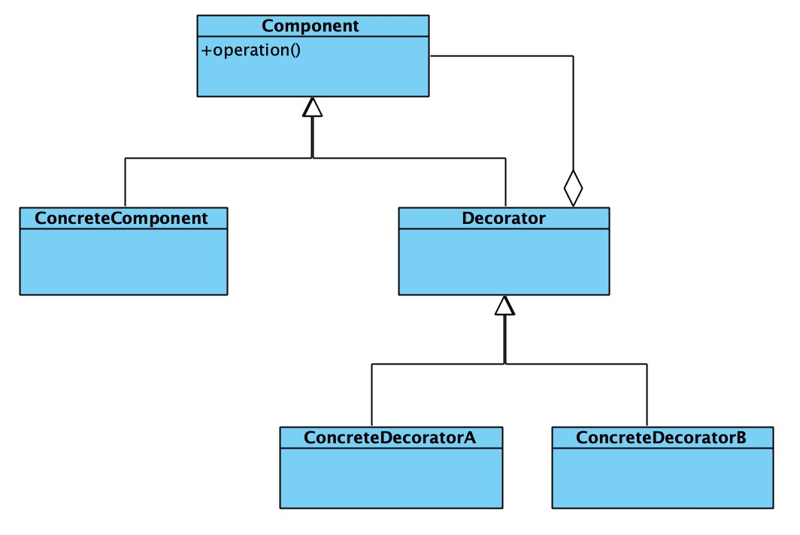
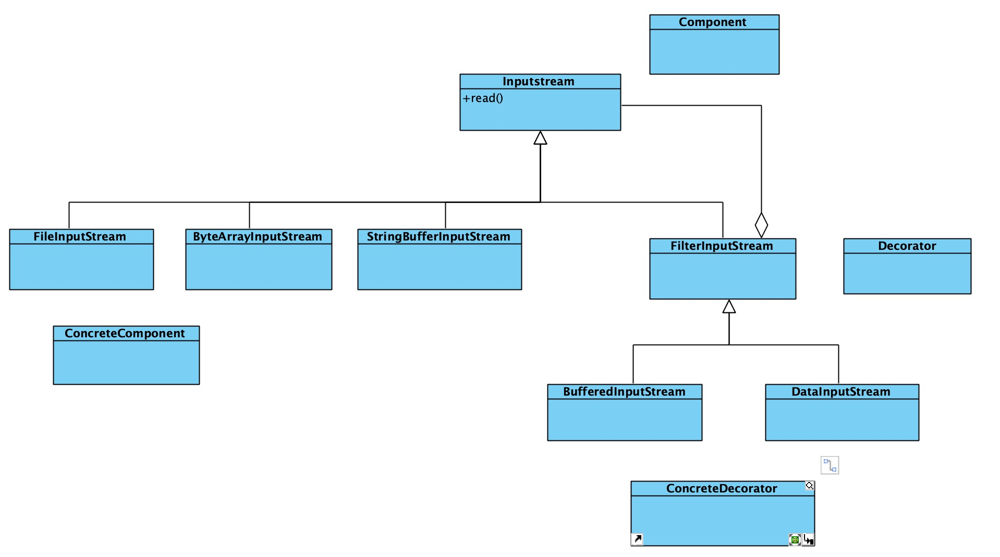

# 1. 基本概念
## 1.1 定义
动态地给一个对象添加一些额外的职责。

就新增功能来说，装饰模式相比生成子类更加灵活。

## 1.2 结构类图


- Component抽象组件
装饰者和被装饰者共同的父类，是一个接口或者抽象类，用来定义基本行为。

- ConcreteComponent具体构件
定义具体对象，即被修饰者

- Decorator
1）抽象装饰者，继承自Component，从外类来扩展ConcreteComponent。
2）对于ConcreteComponent来说，不需要知道Decorator的存在。

- ConcreteDecorator
具体装饰者，用于扩展ConcreteComponent

# 2. 为什么要使用装饰者模式

使用Java IO 读取test.txt文件，需要先创建一个FileInputStream对象，然后再传递给BufferedInputStream对象来使用。
其中，InputStream是一个抽象类，FileInputStream是专门用来读取文件流的子类。BufferedInputStream是一个支持带缓存功能
的数据读取类，可以提高数据读取的效率。
```
InputStream in = new FileInputStream("/user/wangzheng/test.txt");
InputStream bin = new BufferedInputStream(in);
byte[] data = new byte[128];

while (bin.read(data) != -1) {
    // .....
}
```

Java IO为什么不设计一个继承FileInputStream并且支持缓存的BufferedInputStream类呢？这样我们就可以像下面的代码这样，
直接创建一个BufferedInputStream类对象，打开文件读取数据，用起来岂不是更加简单。
```
InputStream bin = new BufferedFileInputStream("/user/wangzheng/test.txt"); 
byte[] data = new byte[128];

while (bin.read(data) != -1) {
    //... 
}
```

## 2.1 基于继承的设计方案
如果InputStream只有一个子类FileInputStream的话，那我们在FileInputStream基础之上，再设计一个孙子类BufferedInputStream，
也算是可以接受，毕竟继承结构还算简单。

但实际上，继承InputStream的子类有很多。我们需要给每一个InputStream的子类，再派生出支持缓存读取的子类。
除了支持缓存读取外，如果我们还需要对功能进行其他方面的增加，比如下面的DataInputStream类，支持按照基本数据类型(int、boolean、long等)来读取数据。
```
FileInputStream in = new FileInputStream("/user/wangzheng/test.txt"); 
DataInputStream din = new DataInputStream(in);
int data = din.readInt();
```

如果我们需要附加更多的增强功能，那就会导致组合爆炸，类继承结构变得无比复杂，代码既不好扩展，也不好维护。

## 2.2 基于装饰器模式的设计方案
针对刚刚的继承结构过于复杂的问题，我们可以通过将继承关系改为组合关系来解决。

下面代码展示了Java IO的这种设计思路。



- InputStream
```
public abstract class InputStream { 

    //...
    public int read(byte b[]) throws IOException { 
        return read(b, 0, b.length);
    }
    
    public int read(byte b[], int off, int len) throws IOException { 
        //...
    }
    
    public long skip(long n) throws IOException { 
        //...
    }
    
    public int available() throws IOException { 
        return 0;
    }
    
    public void close() throws IOException {} 
    
    public synchronized void mark(int readlimit) {}
    
    public synchronized void reset() throws IOException { 
        throw new IOException("mark/reset not supported");
    }
    
    public boolean markSupported() { 
        return false;
    } 
    
}
```

- BufferedInputStream
```
public class BufferedInputStream extends InputStream { 
    protected volatile InputStream in;
    
    protected BufferedInputStream(InputStream in) { 
        this.in = in;
    }
    
    //...实现基于缓存的读数据接口... 
}
```

- DataInputStream
```
public class DataInputStream extends InputStream { 

    protected volatile InputStream in;
    
    protected DataInputStream(InputStream in) { 
        this.in = in;
    }
    
    //...实现读取基本类型数据的接口 
}

```

### 2.2.1 使用方式
```
InputStream in = new FileInputStream("/user/xxx/test.txt"); 
InputStream bin = new BufferedInputStream(in);
```

- 装饰器模式相对于简单的组合关系，还有两个比较特殊的地方

1）装饰器类和原始类继承同样的父类，这样我们可以对原始类“嵌套”多个装饰器类。

比如，下面这样一段代码，我们对FileInputStream嵌套了两个装饰器类:BufferedInputStream和DataInputStream，
让它既支持缓存读取，又支持按照基本数据类型来读取数据。
```
InputStream in = new FileInputStream("/user/wangzheng/test.txt"); 
InputStream bin = new BufferedInputStream(in);
DataInputStream din = new DataInputStream(bin);
int data = din.readInt();
```

2）装饰器类是对功能的增强，这也是装饰器模式应用场景的一个重要特点

实际上，符合“组合关系”这种代码结构的设计模式有很多，比如之前讲过的代理模式、桥接模式，还有现在的装饰器模式。尽管它们的代码结构很相似，但是每种设计模式的意图是不同的。
就拿比较相似的代理模式和装饰器模式来说吧，代理模式中，代理类附加的是跟原始类无关的功能，而在装饰器模式中，装饰器类附加的是跟原始类相关的增强功能。

# 3. 总结
我们可以通过代理模式给接口添加缓存功能。也尅一通过装饰者模式给 InputStream添加缓存读取数据功能。
那对于“添加缓存”这个应用场景来说，我们到底是该用代理模式还是装饰器模式呢?

1）对于添加缓存这个应用场景使用哪种模式，要看设计者的意图，如果设计者不需要用戶关注是否使用缓存功能，要隐藏实现细节，
也就是说用戶只能看到和使用代理类，那么就使用proxy模式;

2）反之，如果设计者需要用戶自己决定是否使用缓存的功能，需要用戶自己新建原始对象并动态添加缓存功能，
那么就使用 decorator模式。


