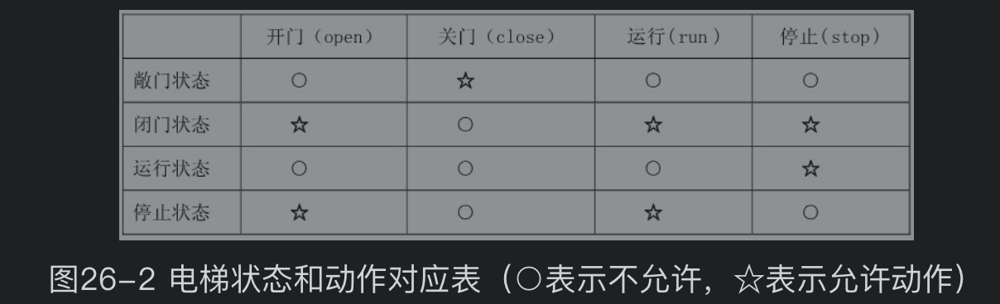
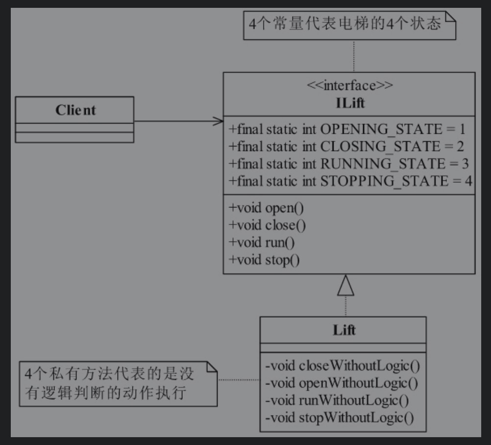
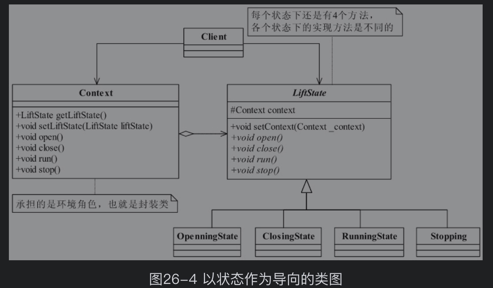

# 1. 实现方式

以电梯为例，介绍状态机的三种实现方式。



## 1.1 分支逻辑法

在接口中定义了四个常量，分别表示电梯的4个状态：敞门状态、闭门状态、运行状态、停止状态，然后在实现类中电梯的每一次动作都要对
状态进行判断，判断是否可以执行，也就是动作的执行是否符合业务逻辑，实现类中有4个私有方法是仅仅实现电梯的动作，没有任何前置条件，
因此这4个方法是不能为外部类调用的，设置为私有方法。



### 1.1.1 电梯接口类
```
public interface ILift {

    //电梯的4个状态
    public final static int OPENING_STATE = 1;  //敞门状态
    public final static int CLOSING_STATE = 2;  //闭门状态
    public final static int RUNNING_STATE = 3;  //运行状态
    public final static int STOPPING_STATE = 4; //停止状态

    //设置电梯的状态
    public void setState(int state);

    //电梯门开启动作
    public void open();
    //电梯门可以开启，那当然也就有关闭了
    public void close();
    //电梯要能上能下，运行起来
    public void run();
    //电梯还要能停下来
    public void stop();
}
```

### 1.1.2 电梯实现类

```
public class Lift implements ILift {

    private int state;

    @Override
    public void setState(int state) {
        this.state = state;
    }

    /**
     * 电梯门开启
     */
    @Override
    public void open() {
        //电梯门在什么时候才能开启
        switch (this.state){
            case OPENING_STATE:
                //已经处于开门状态，什么都不做
                break;
            case CLOSING_STATE:
                //闭门状态，则可以开启
                this.openWithouyLogic();
                this.setState(OPENING_STATE);
                break;
            case RUNNING_STATE:
                //运行状态，则不能开门，什么都不做
                break;
            case STOPPING_STATE:
                //停止状态，当然要开门了
                this.openWithouyLogic();
                this.setState(OPENING_STATE);
                break;
        }
    }

    /**
     * 电梯关门
     */
    @Override
    public void close() {
        //电梯在什么状态下才能关闭
        switch (this.state){
            case OPENING_STATE:
                //可以关门，同时修改电梯状态
                this.closeWithoutLogic();
                this.setState(CLOSING_STATE);
                break;
            case CLOSING_STATE:
                //电梯是关门状态，则什么都不做
                break;
            case RUNNING_STATE:
                //正在运行，门本来就是关闭的，也什么都不做
                break;
            case STOPPING_STATE:
                //停止状态，门也是关闭的，什么都不做
                break;
        }
    }

    /**
     * 电梯开始运行起来
     */
    @Override
    public void run() {
        switch (this.state){
            case OPENING_STATE:
                //敞门状态，什么都不做
                break;
            case CLOSING_STATE:
                //闭门状态，则可以运行
                this.runWithouyLogic();
                this.setState(RUNNING_STATE);
                break;
            case RUNNING_STATE:
                //运行状态，则什么都不做
                break;
            case STOPPING_STATE:
                //停止状态，可以运行
                this.runWithouyLogic();
                this.setState(RUNNING_STATE);

        }
    }

    @Override
    public void stop() {
        switch (this.state){
            case OPENING_STATE:
                //敞门状态，要先停下来的，什么都不做
                break;
            case CLOSING_STATE:
                //闭门状态，则当然可以停止了
                this.stopWithouyLogic();
                this.setState(STOPPING_STATE);
                break;
            case RUNNING_STATE:
                //运行状态，有运行当然那也就有停止了
                this.stopWithouyLogic();
                this.setState(STOPPING_STATE);
                break;
            case STOPPING_STATE:
                //已经处于停止状态，什么都不做
                break;
        }
    }

    //纯粹的电梯关门，不考虑实际逻辑
    private void closeWithoutLogic(){
        System.out.println("电梯门关闭....");
    }
    //纯粹的电梯开门，不考虑任何条件
    public void openWithouyLogic(){
        System.out.println("电梯门开启....");
    }
    //纯粹的运行，不考虑任何条件
    public void runWithouyLogic(){
        System.out.println("电梯上下运行起来....");
    }
    //纯粹的停止，不考虑任何条件
    public void stopWithouyLogic(){
        System.out.println("电梯停止了....");
    }
}
```

## 1.2 分支逻辑法的缺点

### 1.2.1 电梯实现类Lift有点长
长的原因是我们在程序中使用了大量的switch-case这样的判断(if-else也是一样)，程序中只要有这样的判断就避免不了加长程序，
而且在复杂的情况下，程序会更长，这就不是一个很好的习惯了。较长的方法和类无法带来良好的维护性，毕竟，程序首先是给人阅读的，
然后才是机器执行。

### 1.2.2 扩展性非常差劲
大家想想，电梯还有两个状态没有加，是什么？通电状态和断电状态，你要是在程序增加这两个方法，你看看open()、close()、
run()、stop() 这4个方法都要增加判断条件，也就是说switch判断体中还要增加case项，这与开闭原则相违背。

# 2. 状态模式
既然我们已经发现程序中有以上问题，我们怎么来修改呢？刚刚我们是从电梯的方法以及这些方法执行的条件去分析，现在我们换个角度
来看问题。我们来想，**电梯在具有这些状态的时候能够做什么事情，也就是说在电梯处于某个具体的状态时，我们来思考这个状态是由什么
动作触发而产生的，以及在这个状态下电梯还能做什么事情**。

既然我们以状态为参考模型，那我们就先定义电梯的状态接口，类图如下：



在类图中，
（1）定义了一个LifeState抽象类，
（2）声明了一个受保护的类型Context变量，这个是串联各个状态的封装类。封装的目的很简单，就是电梯对象内部状态的变化不被调用类知晓，
    也就是迪米特法则了（我的类内部情节你知道得越少越好）。
（3）并且定义了4个具体的实现类，承担的是状态的产生以及状态间的转换过度（本状态下能做什么事情，以及能过渡到什么状态下做什么事情）

## 2.1 具体代码

### 2.1.1 抽象电梯状态
```
public abstract class LiftState {

    //定义一个环境角色，也就是封装状态的变化引起的功能变化
    protected Context context;

    public void setContext(Context context) {
        this.context = context;
    }

    //首先电梯门开启动作
    public abstract void open();
    //电梯门有开启，那当然也就有关闭了
    public abstract void close();
    //电梯要能上能下，运行起来
    public abstract void run();
    //电梯还能停止下来
    public abstract void stop();

}
```

### 2.1.2 具体实现

#### 2.1.2.1 敞门状态
抽象类比较简单，我们先看一个具体的实现--敞门状态的实现类

```
public class OpenningState extends LiftState {

    /**
     * 电梯门开启，这是开启状态要实现的动作
     */
    @Override
    public void open() {
        System.out.println("电梯门开启...");
    }

    @Override
    public void close() {
        //开启状态下当然可以关闭了，我就想测试一下电梯门开关功能
        //状态修改
        super.context.setLiftState(Context.closingState);
        //动作委托给context来执行
        super.context.getLiftState().close();
    }

    @Override
    public void run() {
        //门开着时电梯就运行，这电梯，吓死你
        //do nothing
    }

    @Override
    public void stop() {
        //开门还不停止?
        //do nothing
    }
}
```

#### 2.1.2.2 环境角色
```
public class Context {

    //定义出所有的电梯状态
    public final static OpenningState openningState = new OpenningState();
    public final static ClosingState closingState = new ClosingState();
    public final static RunningState runningState = new RunningState();
    public final static StoppingState stoppingState = new StoppingState();

    //定义一个当前电梯状态
    private LiftState liftState;

    public LiftState getLiftState(){
        return this.liftState;
    }

    public void setLiftState(LiftState liftState){
        this.liftState = liftState;
        //把当前的环境通知到各个实现类中
        this.liftState.setContext(this);
    }

    public void open(){
        this.liftState.open();
    }

    public void close(){
        this.liftState.close();
    }

    public void run(){
        this.liftState.run();
    }

    public void stop(){
        this.liftState.stop();
    }
}
```


#### 2.1.2.3 场景类
```
public class Client {

    public static void main(String[] args){
        Context context = new Context();
        context.setLiftState(new ClosingState());

        context.open();
        context.close();
        context.run();
        context.stop();
    }
}

```


