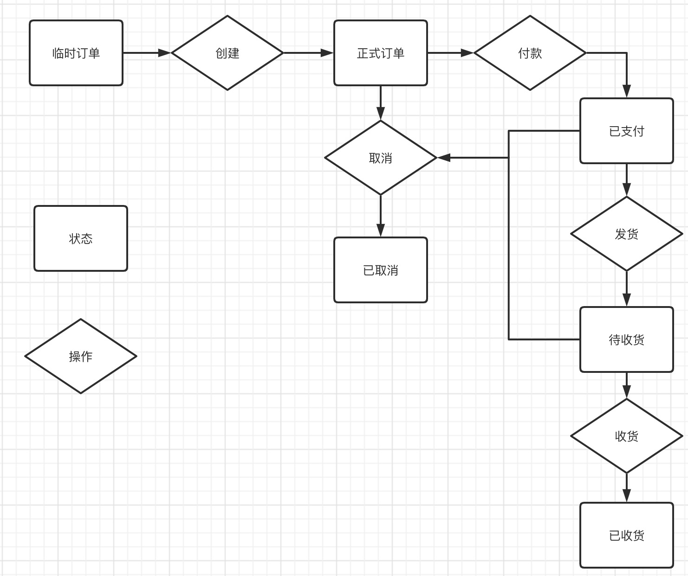

我们知道一个订单会有很多种状态：临时单、已下单、待支付、待收货、待评价、已完成、退货中等等。每一种状态都和其扭转前的状态，
在扭转前状态所执行的动作有关。

# 1. 实例说明
举例一个过程：用户将商品加入购物车，在后台生成了一个所谓的"临时单"，这个订单实际上还没有正式生成，因为用户仍然没有点击下单。
只有当用户下单后，这个"临时单"才可以转化为一个"待支付的订单"。在这个过程中，如果是硬编码，那么我们需要一系列的if-else语句
来检查订单的当前状态、可执行的操作以及这两个的组合得到的下一个应该被流转的状态值。如果订单的状态流转很复杂的话，写出来的逻辑
就会很复杂，并且可读性很低。后期的维护就是一个坑。

# 2. 状态设计模式与订单状态流转
处理这个问题，我们可以使用**状态机设计模式**来处理。对应到实践，就是状态机。

状态机设计模式：对象的内部状态随外部执行条件的变化而变化。再映射到订单状态的流转上：订单的状态，随订单当前状态和目前执行操作
的组合而变化。



图示模拟一个订单状态的流程过程。从一个临时订单开始，每当订单处于某一个已知的状态的时候，要想让这个订单改变状态，就需要我们
去执行相应的操作。从状态机角度来说，我们先将各种信息进行抽象和处理。

# 3. 代码抽象

## 3.1 编写对应订单状态枚举类
```
public enum OrderStatusEnum {

    CREATE_EVENT(1, "创建订单"),
    FORMAL_EVENT(2, "正式订单"),
    NEED_PAY(3, "待支付"),
    PAY_DONE(4, "支付完成"),
    ORDER_FINISHED(5, "订单已完成"),

    ORDER_CANCEL(6, "订单取消"),
    
    ;
    OrderStatusEnum(int status, String desc){
        this.status = status;
        this.desc = desc;
    }

    public int status;
    public String desc;
}
```

## 3.2 核心代码
一个管理订单状态的中转站manager类，一组用于扭转订单状态的operator类，一组扭转完订单状态后执行后续逻辑操作的processor类。

### 3.2.1 manager类
manager类需要根据对应传入的当前订单状态、要对订单执行操作来得到订单的结果状态(依靠对应的operator类)，然后执行一系列需要的业务逻辑操作（编写对应的processor类）。

这样的好处就是将订单状态流转和对应的业务处理解耦，并且也不会再有一堆繁杂的if-else操作。每当需要新的订单状态流转操作的时候，可以去编写对应的一套operator和processor组件来
完成和已有的业务分离°很高。

```
public class OrderStateManager {

    Map<Integer, AbstractOrderOperator> orderOperatorMap = new HashMap<>(64);
    Map<Integer, AbstractOrderProcessor> orderProcessorMap = new HashMap<>(64);

    public OrderStateManager() {}

    public int handleEvent(final String orderId, OrderStatusEnum event, final int status) {
        if (isFinalStatus(status)) {
            throw new IllegalArgumentException("handle event can't process final status order");
        }

        //获取对应处理器，根据入参状态和时间获取订单流程的结果状态
        AbstractOrderOperator orderOperator = this.getOrderOperator(event);
        int resState = orderOperator.handleEvent(status, event);
        //在对应的processor中处理订单数据及其相关信息
        AbstractOrderProcessor orderProcessor = this.getOrderProcessor(event);
        if (!orderProcessor.process(orderId, resState)){
            throw new IllegalArgumentException(String.format("订单状态流转失败，订单id:%s", orderId));
        }

        return resState;
    }

    /**
     * 根据入参状态枚举获取相应的状态处理器
     * @param event
     * @return
     */
    private AbstractOrderOperator getOrderOperator(OrderStatusEnum event) {
        AbstractOrderOperator operator = null;
        for (Map.Entry<Integer, AbstractOrderOperator> entry : orderOperatorMap.entrySet()) {
            if (event.status == entry.getKey()) {
                operator = entry.getValue();
            }
        }

        if (Objects.isNull(operator)) {
            throw new IllegalArgumentException(
                String.format("can't find proper operator. the parameter status : %s", event.toString()));
        }

        return operator;
    }

    /**
     * 根据入参状态枚举实例获取对应的状态后处理器
     * @param event
     * @return
     */
    private AbstractOrderProcessor getOrderProcessor(OrderStatusEnum event){
        AbstractOrderProcessor orderProcessor = null;
        for (Map.Entry<Integer, AbstractOrderProcessor> entry : orderProcessorMap.entrySet()) {
            if (event.status == entry.getKey()) {
                orderProcessor = entry.getValue();
            }
        }

        if (Objects.isNull(orderProcessor)) {
            throw new IllegalArgumentException(
                String.format("can't find proper operator. the parameter status : %s", event.toString()));
        }

        return orderProcessor;
    }

    /**
     * 判断是不是已完成的订单
     *
     * @param status
     * @return
     */
    private boolean isFinalStatus(int status) {
        return OrderStatusEnum.ORDER_FINISHED.status == status;
    }
}
```