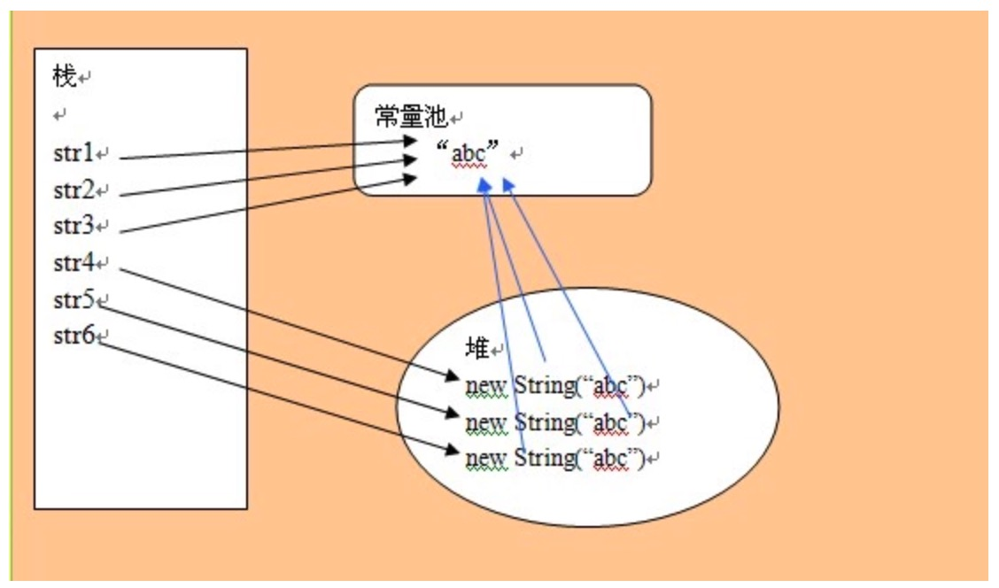

# 1. 享元模式在Java Integer中的应用
在Java Integer的实现中，-128到127之间的整数对象会被事先创建好，缓存在IntegerCache类中。当我们使用自动装箱或者valueOf()
来创建这个数值区间的整型对象时，会复用IntegerCache类事先创建好的对象。

这里的IntegerCache类就是享元工厂类，事先创建好的整型对象就是享元对象。

## 1.1 自动装箱&自动拆箱
- 所谓自动装箱，就是自动将基本数据类型转换为包装器类型；
- 所谓自动拆箱，就是自动将包装器类型转化为基本数据类型。
```
Integer i = 56; //自动装箱，底层执行了:Integer i = Integer.valueOf(59);
int j = i; //自动拆箱，底层执行了:int j = i.intValue();
```

## 1.2 Integer题目
```
Integer i1 = 56;
Integer i2 = 56;
Integer i3 = 129;
Integer i4 = 129; 
System.out.println(i1 == i2); // true
System.out.println(i3 == i4); // false

// 使用Integer类的equals()方法进行的是数值的比较 
Integer a9 = 129;
Integer a10 = 129;
System.out.println("Integer类的equals()方法进行的是数值的比较 a9 == a10: " + a9.equals(a10));
```

因为Integer用到了享元模式来复用对象，当我们通过自动装箱，也就是调用valueOf()来创建Integer对象的时候，如果要创建的Integer对象
的值在-128到127之间，会从IntegerCache类中直接返回，否则才调用new方法创建。具体代码如下：
```
public static Integer valueOf(int i) {
    if (i >= IntegerCache.low && i <= IntegerCache.high){
        return IntegerCache.cache[i + (-IntegerCache.low)]; 
    }
    return new Integer(i);
}
```

下面就是Integer源码，可以看出equals进行的就是数值的比较：
```
public boolean equals(Object obj) {
    if (obj instanceof Integer) {
        return value == ((Integer)obj).intValue();
    }
    return false;
}
```

- 为什么只缓存-128到127之间的整数
毕竟整型的数字太多，我们不可能在IntegerCache中预先创建好所有的整型数字，这样占用太多的内存，也使得加载Integer的时间过长。

所以，我们只能选择缓存对于大部分应用来说常用的整型数字。

# 2. 享元模式在Java String中的应用

**字符串常量池存在于方法区**

```
String str1 = “abc”;
String str2 = “abc”;
String str3 = “abc”;
String str4 = new String(“abc”);
String str5 = new String(“abc”);

System.out.println(str1 == str2); // true
System.out.println(str2 == str3); // true
System.out.println(str3 == str4); // false
System.out.println(str4 == str5); // false
```



跟Integer类的设计思路相似，String类利用享元模式来复用相同的字符串常量。JVM会专⻔开辟一块存储区来存储字符串常量，这块存 储区叫作“字符串常量池”。

不过，String类的享元模式的设计，跟Integer类稍微有些不同。Integer类中要共享的对象，是在类加载的时候，就集中一次性创建好的。
但是，对于字符串来说，我们没法事先知道要共享哪些字符串常量，所以没有办法事先创建好，只能在某个字符串常量第一次被用到的时候，
存储到常量池中；当之后再用到的时候，直接引用常量池中已经存在的即可，就不需要重新创建了。

## 2.1 面试题
String str1 = new String("A"+"B") ; 会创建多少个对象

字符串常量池："A"，"B"，"AB" 3个
堆：new String("AB")       1个
引用：str1                 1个
总共 5个


String str2 = new String("ABC") + "ABC" ; 会创建多少个对象

字符串常量池： "ABC"        1个
堆：   new String("ABC")   1个  
引用： str2                1个
总共  3个


