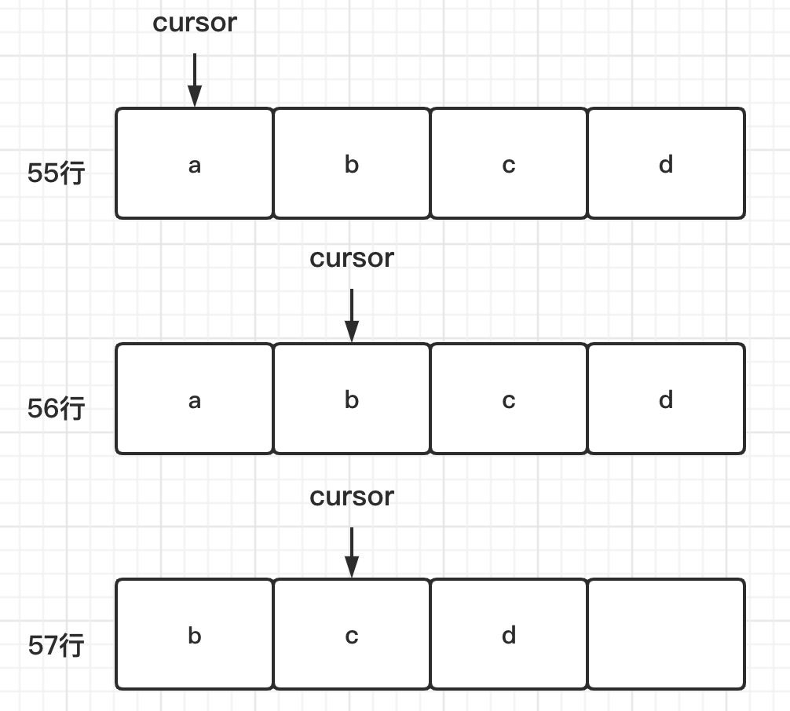
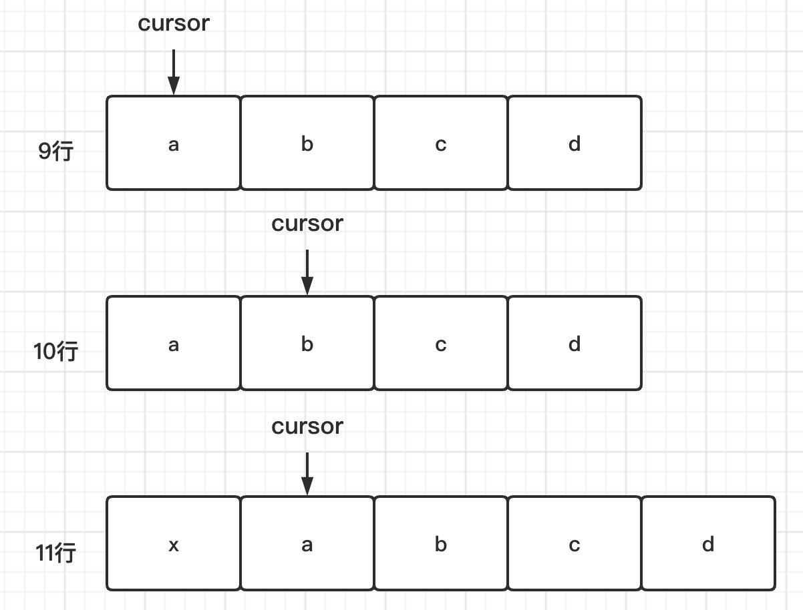
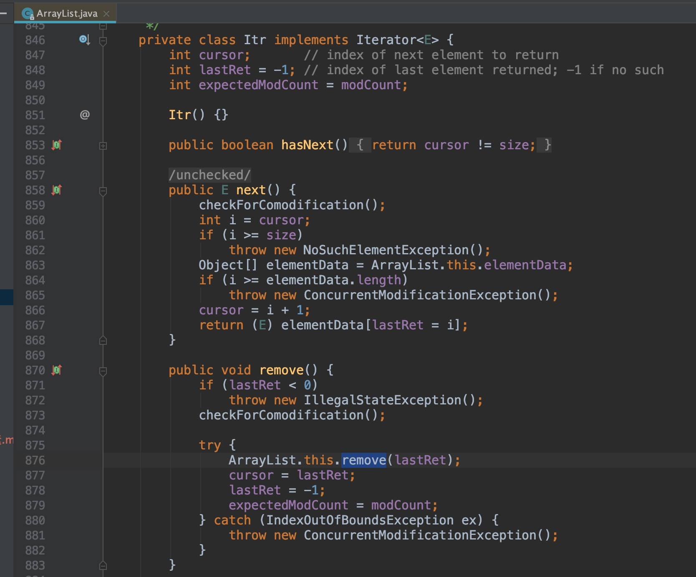

# 1. 为什么不能在遍历集合时增加集合元素

在通过迭代器来遍历集合元素的同时，增加或者删除集合中的元素，有可能会导致某个元素被重复遍历或遍历不到。不过，并不是所有情况下
都会遍历出错，有时候也能正常遍历，所以，这种行为称为**结果不可预期行为或者未决行为**。

实际上，"不可预期"比直接出错更加可怕，有的时候运行正确，有的时候运行出错，一些隐藏很深，很难debug的bug就是这样产生的。

## 1.1 删除元素

我们知道，ArrayList底层对应的是数组这种数据结构，在执行完第55行代码的时候，数组中存储的是a、b、c、d四个元素，迭代器的游标
cursor指向元素a。当执行完第56行代码后，游标执行元素b。

为了保持数组存储数据的连续性，数组的删除操作会涉及元素的搬移。

当执行到第57行代码的时候，我们从数组中将元素a删除掉，b、c、d三个元素会依次往前搬移一位，这就会导致游标本来指向元素b，现在变成了
指向元素c。原来在执行完第56行代码之后，我们还可以遍历到b、c、d三个元素，但在执行完第57行代码后，我们只能遍历到c、d两个元素，
b遍历不到了。

- 不过，如果第57行代码删除的不是游标前面的元素（元素a）以及游标所在位置的元素（元素b），而是游标后面的元素（元素c和元素d），
这样就不会存在任何问题了，不会存在某个元素遍历不到的情况。

所以，我们前面说，在遍历的过程中删除集合元素，结果是不可预期的，有时候有问题（删除元素c或d），有时候就有问题（删除元素a或b），
这个要视情况而定（到底删除的是哪个位置的元素），就是这个意思。

## 1.2 增加元素
前面我们说了，在遍历的过程中删除集合元素，有可能会导致某个元素遍历不到，那在遍历的过程中添加元素，会发生什么情况呢？

在执行完第10行代码之后，数组中包含a、b、c、d四个元素，游标指向b这个元素，已经跳过了元素a。在执行完第11行代码之后，我们将x插入到
下标为0的位置，a、b、c、d四个元素依次往后移动一位。这个时候，游标又重新指向了元素a。元素a被游标重复指向两次，也就说，元素a存在被
重复遍历的情况。

**跟删除情况类似，如果我们在游标的后面添加元素，就不会存在任何问题**。所以，在遍历的同时添加集合元素也是一种不可预期行为。

# 2. 解决方案

## 2.1 遍历的时候不允许增删元素
迭代器比较难实现，但可以依靠客户端在使用集合时注意这一点。

## 2.2 增删元素后让遍历报错
Java语言就是采用这种方案，增删元素之后，让遍历报错。

怎么确定在遍历的同时，集合有没有增删元素呢？

- 我们在ArrayList中定义一个成员变量modCount，记录集合被修改的次数，集合每调用一次增加或删除元素的函数，就会给modCount加1。
- 当通过调用集合上的iterator()函数来创建迭代器的时候，我们把modCount值传递给迭代器的expectedModCount成员变量
- 之后每次调用迭代器上的hasNext()、next()、currentItem()函数，我们都会检查集合上的modCount是否等于expectedModCount，
也就是看，在创建完迭代器之后，modCount是否改变过。
- 如果两个值不相同，那就说明集合存储的元素已经改变了，之前创建的迭代器已经不能正确运行了，再继续使用就会产生不可预期的结果，
所以我们选择fail-fast解决方式，抛出运行时异常，结束掉程序。

# 3. 如果在遍历的同时安全删除元素

Java语言的迭代器类提供了remove()方法，能够在遍历元素的同时，安全的删除集合中的元素。不过这个remove()函数比较鸡肋，它只能
删除游标指向的前一个元素。

源码之前无秘密:

在上面的代码实现中，迭代器类新增了一个lastRet成员变量，用来记录游标执行的前一个元素。通过迭代器去删除这个元素的时候，我们
可以更新迭代器中的游标和lastRet值，来保证不会因为删除元素而导致某个元素遍历不到。