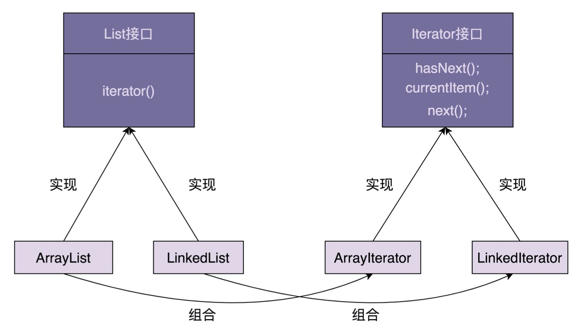

# 1. what
迭代器模式，也叫做游标模式。

它用来遍历集合对象。这里说的"集合对象"，我们也可以叫"容器"。"集合对象"，实际上就是包含一组对象的对象，比如，数组、链表、树、
图、跳表。


# 2. how
一个完整的迭代器模式，一般会涉及容器和容器迭代器两部分内容。为了达到基于接口而非实现编程的目的，容器又包含容器接口、容器实现类，
迭代器又包含迭代器接口、迭代器实现类。



## 2.1 Iterator接口的定义

具体代码如下：
```
public interface Iterator<E> {

    boolean hasNext();

    void next();

    E currentItem();
}

public interface Iterator2<E> {

    boolean hasNext();

    E next();
}
```

在第一种定义中，next()函数用来将游标后移一位元素，currentItem()函数用来返回当前游标指向的元素。在第二种定义中，返回当前元素
与后移一位这两个操作，要放到同一个函数next()中完成。

第一种定义方式更加灵活一些，比如我们可以多次调用currentItem()查询当前元素，而不移动游标。所以，在接下来的实现中，我们选择第一种
接口定义方式。

## 2.2 ArrayIterator的代码实现
```
public class ArrayIterator<E> implements Iterator<E> {

    private int cursor;
    private ArrayList<E> arrayList;

    public ArrayIterator(ArrayList<E> arrayList) {
        this.cursor = 0;
        this.arrayList = arrayList;
    }

    @Override
    public boolean hasNext() {
        //注意这里，cursor在指向最后一个元素的时候，hasNext()仍旧返回true
        return this.cursor != arrayList.size();
    }

    @Override
    public void next() {
        cursor++;
    }

    @Override
    public E currentItem() {
        if (cursor >= arrayList.size()) {
            throw new NoSuchElementException();
        }
        return arrayList.get(cursor);
    }
}
```

## 2.3 调用案例
```
public class Demo {

    public static void main(String[] args) {

        ArrayList<String> names = new ArrayList<>();
        names.add("test1");
        names.add("test2");
        names.add("test3");

        Iterator<String> iterator = new ArrayIterator<>(names);
        while (iterator.hasNext()) {
            System.out.println(iterator.currentItem());
            iterator.next();
        }
    }
}
```

# 3. why
遍历集合一般有三种方式：for循环、foreach循环、迭代器遍历。

foreach循环只是一个语法糖而已，底层是基于迭代器实现的。所以，后两种本质上属于一种，都可以看做迭代器遍历。
```
// 第一种遍历方式:for循环
for (int i = 0; i < names.size(); i++) {
    System.out.print(names.get(i) + ","); 
}

// 第二种遍历方式:foreach循环 
for (String name : names) {
    System.out.print(name + ",") 
}

// 第三种遍历方式:迭代器遍历
Iterator<String> iterator = names.iterator(); 
while (iterator.hasNext()) {
    System.out.print(iterator.next() + ",");//Java中的迭代器接口是第二种定义方式，next()既移动游标又返回数据 
}
```

相对于for循环遍历，利用迭代器来遍历有下面三个优势：

- 迭代器模式封装了集合内部的复杂数据结构，开发者不需要了解如何遍历，直接使用容器提供的迭代器即可；
- 迭代器模式将集合对象的遍历操作从集合中拆分出来，放到迭代器类中，让两者的职责更加单一；
- 迭代器模式让添加新的遍历算法更加容易，更符合开闭原则。除此之外，因为迭代器都实现相同的接口，在开发中，基于接口而非实现
编程，替换迭代器也变得更加容易。


