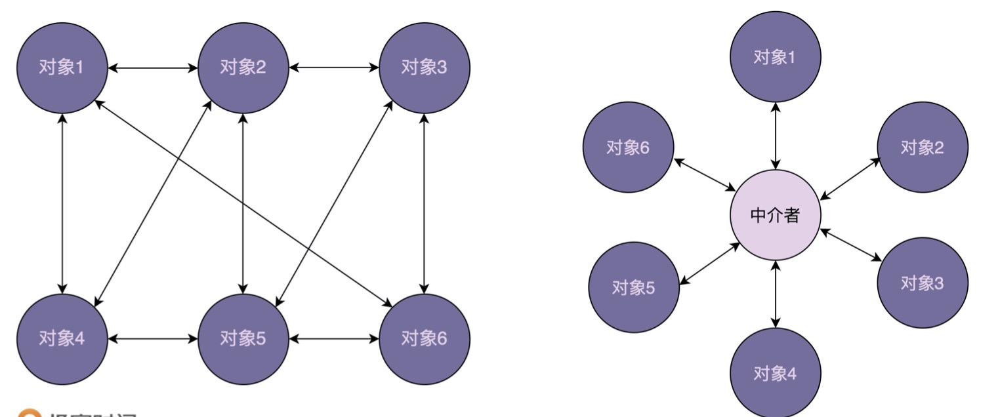

# 1. what
中介模式定义了一个单独的（中介）对象，来封装一组对象之间的交互。将这组对象之间的交互委派给与中介对象交互，来避免对象之间的之间
交互。

提到中介者模式，有一个比较经典的例子不得不说，那就是航空管制。

为了让飞机在飞行的时候互不干扰，每架飞机都需要知道其他飞机每时每刻的位置，这就需要时刻跟其他飞机通信。如果飞机之间直接通信，
那形成的通信网就会无比复杂。这个时候，我们通过引入"塔台"这样一个中介，让每架飞机只跟塔台来通信，发送自己的位置给塔台，由
塔台来负责每架飞机的航线调度。这样就大大简化了通信网络。

**现在流行的微服务，注册中心可以理解为广义的中介模式，防止各个服务间错综复杂的调用**。

# 2. why
实际上，中介模式的设计思想跟中间层很像，通过引入中介这个中间层，将一组对象之间的交互关系（或者说依赖关系）从多对多（网状关系）
转换为一对多（星状关系）。

原来一个对象要跟n个对象交互，现在只需要跟一个中介对象交互，从而最小化对象之间的交互关系，**降低了代码的复杂度，提高了代码的可读性
和可维护性**。

