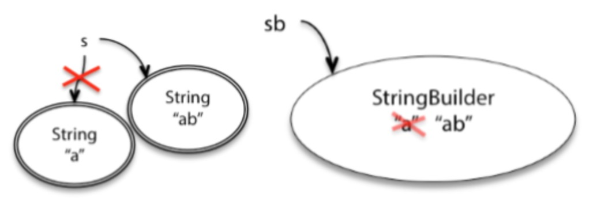
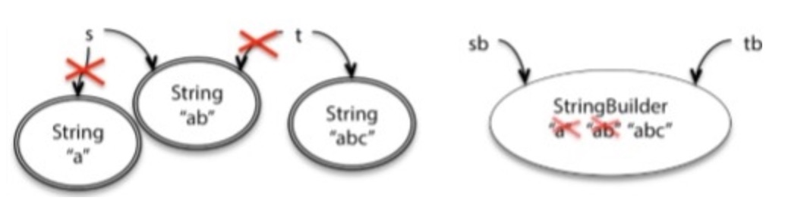

不可变数据类型和可变数据类型(mutable &immutable)

# 1. 基本概念

## 1.1 基本数据类型
Java提供了8种原始数据类型（byte，short，int，long，float，double，char，boolean），这些数据类型不是对象，相应的
变量被定义后会立刻在栈上被分配内存空间。

## 1.2 引用类型
除此之外的数据类型，都是引用类型。引用类型在变量被声明时不会被分配内存空间，只是存储了一个内存地址。

以下内容都是基于内存地址来说的。

### 1.2.1 不可变数据类型
当该数据类型的对应变量的值发生了变化，那么它对应的内存地址也会发生变化。对于这种数据类型，就称不可变数据类型。

## 1.2.2 可变数据类型
当该数据类型的对应变量的值发生了变化，那么它对应的内存地址不发生改变。对于这种数据类型，就称为可变数据类型。

## 1.3 总结
不可变数据类型更改后地址发生改变，可变数据类型更改后地址不发生改变。

# 2. 从Java的String&StringBuilder中看差别
String：不可变数据类型；
StringBuilder：可变数据类型

## 2.1 更改对象的值
1）不可变数据类型：重新将引用指向一个新的地址，新地址中为更改后的值；
2）可变数据类型：在原来的地址上直接更改对象值。 

```
String s = "a"; s = "ab";
StringBuilder sb = "a"; sb = "ab";
```


## 2.2 一个地址被多个对象引用时
```
String s = "a"; s = "ab";
String t = s;
t = t + "c";

StringBuilder sb = "a";   sb = "ab";
StringBuilder tb = sb;
tb.append("c");
```


## 2.3 总结
不可变数据类型：对其修改会产生大量的临时拷贝（需要垃圾回收）；
可变数据类型：最少化拷贝以提高效率，可以共享数据。


